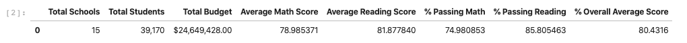
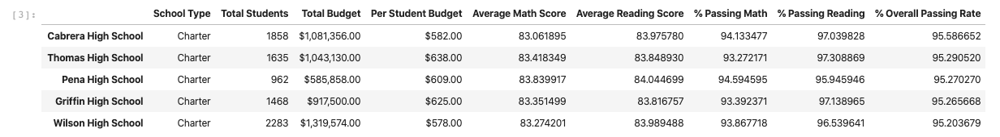
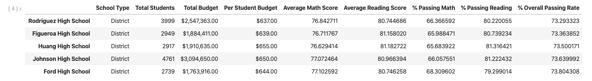
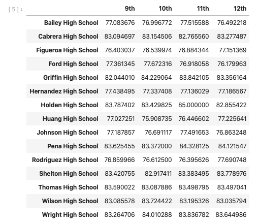

### Background

Example task of a Chief Data Scientist for a city's school district. In this capacity, I helped the school board and mayor make strategic decisions regarding future school budgets and priorities. As a first task, I was asked to analyze the district-wide standardized test results. I was given access to every student's math and reading scores, as well as various information on the schools they attend. My responsibility is to aggregate the data to and showcase obvious trends in school performance.

Sample of students CSV file:
```
Student ID,student_name,gender,grade,school_name,reading_score,math_score
0,Paul Bradley,M,9th,Huang High School,66,79
1,Victor Smith,M,12th,Huang High School,94,61
2,Kevin Rodriguez,M,12th,Huang High School,90,60
3,Dr. Richard Scott,M,12th,Huang High School,67,58
4,Bonnie Ray,F,9th,Huang High School,97,84
5,Bryan Miranda,M,9th,Huang High School,94,94
6,Sheena Carter,F,11th,Huang High School,82,80
7,Nicole Baker,F,12th,Huang High School,96,69
8,Michael Roth,M,10th,Huang High School,95,87
```

Sample of schools CSV file:
```
School ID,school_name,type,size,budget
0,Huang High School,District,2917,1910635
1,Figueroa High School,District,2949,1884411
2,Shelton High School,Charter,1761,1056600
3,Hernandez High School,District,4635,3022020
4,Griffin High School,Charter,1468,917500
5,Wilson High School,Charter,2283,1319574
6,Cabrera High School,Charter,1858,1081356
7,Bailey High School,District,4976,3124928
8,Holden High School,Charter,427,248087
```

My final report includes each of the following:

### District Summary

* Create a high level snapshot (in table form) of the district's key metrics, including:
  * Total Schools
  * Total Students
  * Total Budget
  * Average Math Score
  * Average Reading Score
  * % Passing Math
  * % Passing Reading
  * Overall Passing Rate (Average of the above two)
  


### School Summary

* Create an overview table that summarizes key metrics about each school, including:
  * School Name
  * School Type
  * Total Students
  * Total School Budget
  * Per Student Budget
  * Average Math Score
  * Average Reading Score
  * % Passing Math
  * % Passing Reading
  * Overall Passing Rate (Average of the above two)

### Top Performing Schools (By Passing Rate)

* Create a table that highlights the top 5 performing schools based on Overall Passing Rate. Include all of the same metrics as above.
  


### Bottom Performing Schools (By Passing Rate)

* Create a table that highlights the bottom 5 performing schools based on Overall Passing Rate. Include all of the same metrics as above.



### Math Scores by Grade

* Create a table that lists the average Math Score for students of each grade level (9th, 10th, 11th, 12th) at each school.



### Reading Scores by Grade

* Create a table that lists the average Reading Score for students of each grade level (9th, 10th, 11th, 12th) at each school.

### Scores by School Spending

* Create a table that breaks down school performances based on average Spending Ranges (Per Student). Use 4 reasonable bins to group school spending. Include in the table each of the following:
  * Average Math Score
  * Average Reading Score
  * % Passing Math
  * % Passing Reading
  * Overall Passing Rate (Average of the above two)

### Scores by School Size

* Repeat the above breakdown, but this time group schools based on a reasonable approximation of school size (Small, Medium, Large).

### Scores by School Type

* Repeat the above breakdown, but this time group schools based on school type (Charter vs. District).
